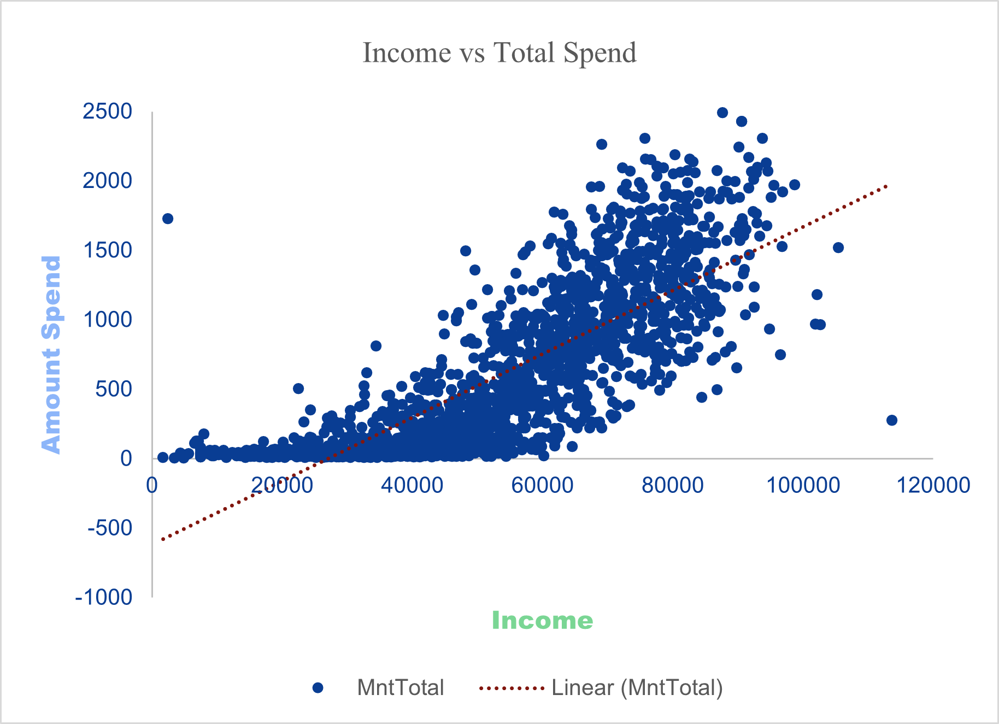
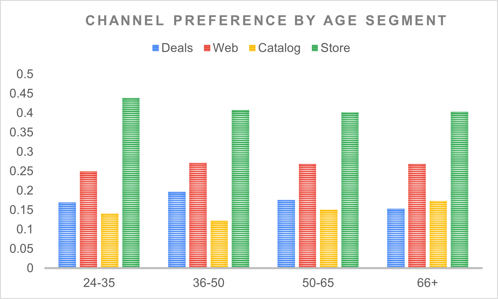
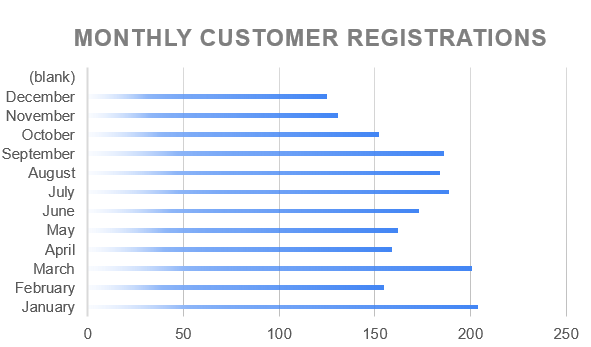
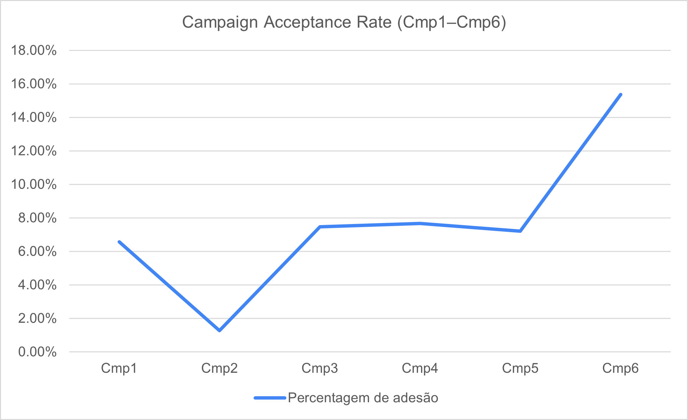
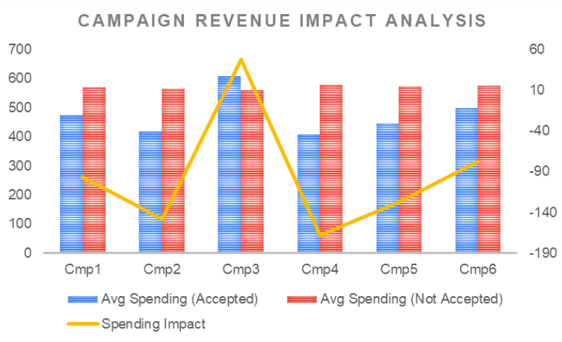
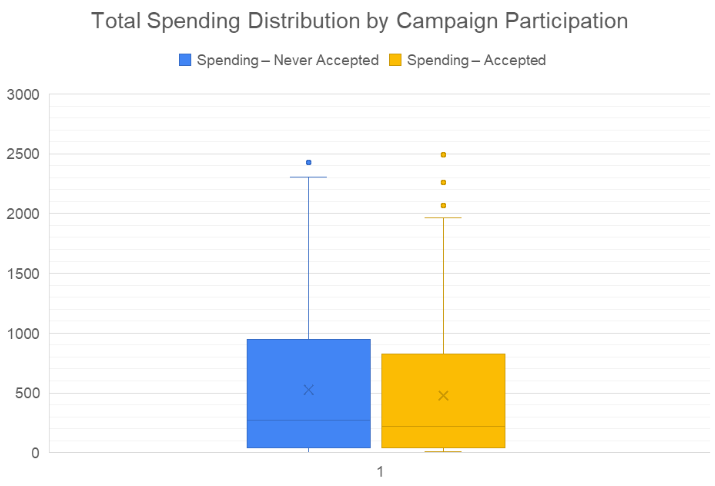

# DoorDash Customer Behavior & Revenue Analysis

## Project Overview

This project analyses customer behaviour, revenue drivers, and campaign performance using Excel.

Developed as part of my Data Analytics Bootcamp, this case study demonstrates how structured analysis in Excel can generate meaningful business insights without relying on complex tools.

The dataset contains:

- 2,022 customers  
- 32 variables  
- 3 years of purchasing data  

Total revenue analysed: **€1,139,418**

---

## Methodology

The analysis was conducted entirely in Excel using:

- Data cleaning and validation  
- Pivot tables for segmentation  
- Correlation analysis  
- Scatter plots with trendlines  
- 100% stacked charts for structural comparison  
- Combined charts with secondary axes  
- Boxplots for distribution analysis  

---

# Key Analysis & Visual Insights

---

## Income vs Total Spending

A strong positive correlation was identified between income and total spending.  
Approximately **67% of spending variation is explained by income**, confirming purchasing power as a major revenue driver.

However, high-spending customers also exist within lower-income segments, reinforcing the importance of behavioural segmentation beyond income alone.

---

## Revenue Contribution by Income & Spending Segment

Customers were segmented using the dataset’s mean values for income and spending.

The **Low Income – High Spender** segment generates the highest total revenue contribution.

This demonstrates that **spending behaviour is a stronger revenue driver than income level alone**.

---

## Channel Preference by Age Group

Channel usage remains relatively consistent across age groups.

- Physical stores dominate across all segments.
- Web usage does not significantly increase among younger customers.
- Catalog usage increases in older segments.
- Deal-based purchases peak in the 36–50 group.

This analysis highlights the importance of validating behavioural assumptions with data.

---

## Customer Acquisition by Month

January and March show peak acquisition levels, while November and December underperform.

This reveals a clear opportunity to stabilise seasonal acquisition through targeted marketing efforts.

---

## Consumption Structure by Income Level

High-income customers allocate over **52% of their consumption to wine**, indicating strong category concentration.

Lower-income customers display a more diversified purchasing structure and allocate a higher share to gold products.

Income influences not only spending capacity but also consumption structure.

---

## Campaign Acceptance Trend

Campaign acceptance rates increased over time, particularly in Campaign 6.

However, engagement alone does not measure performance.

---

## Campaign Revenue Impact

Despite rising conversion rates, most campaigns did not generate higher average spending.

Only **Campaign 3** produced a positive revenue uplift.

This confirms that conversion rate alone is not a sufficient performance metric — incremental revenue impact must also be evaluated.

---

## Promotional Participation vs Spending Distribution

Spending distributions remain similar between customers who accepted promotions and those who did not.

Campaign participation increases engagement but does not fundamentally reshape spending behaviour.

---

# Main Takeaways

- Income explains a significant portion of spending variation.
- Spending behaviour is more decisive than income alone.
- Campaign conversion does not guarantee revenue growth.
- Consumption structure varies by income level.
- Seasonality creates acquisition optimisation opportunities.
- Excel is a powerful tool for structured business analysis.

---

# Files Included

- `doordash_customer_analysis.xlsx` – Full Excel analysis
- `data_dictionary.docx` – Dataset variable description
- `Images/` – Visualisations used in the analysis

---

# Next Steps

This project represents the Excel foundation of my analytics journey.

Future expansions will include similar business-focused analysis using:

- SQL  
- Tableau  
- Python  

While maintaining the same focus: business impact over technical complexity.
